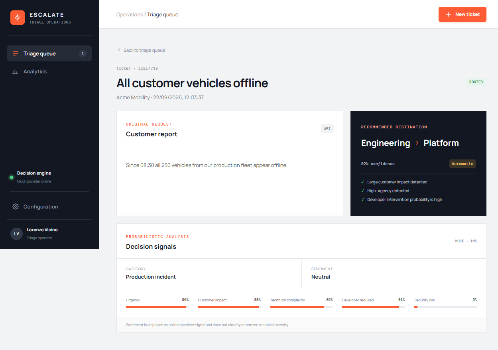
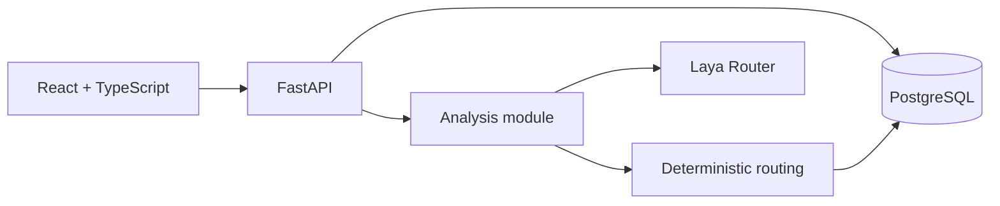
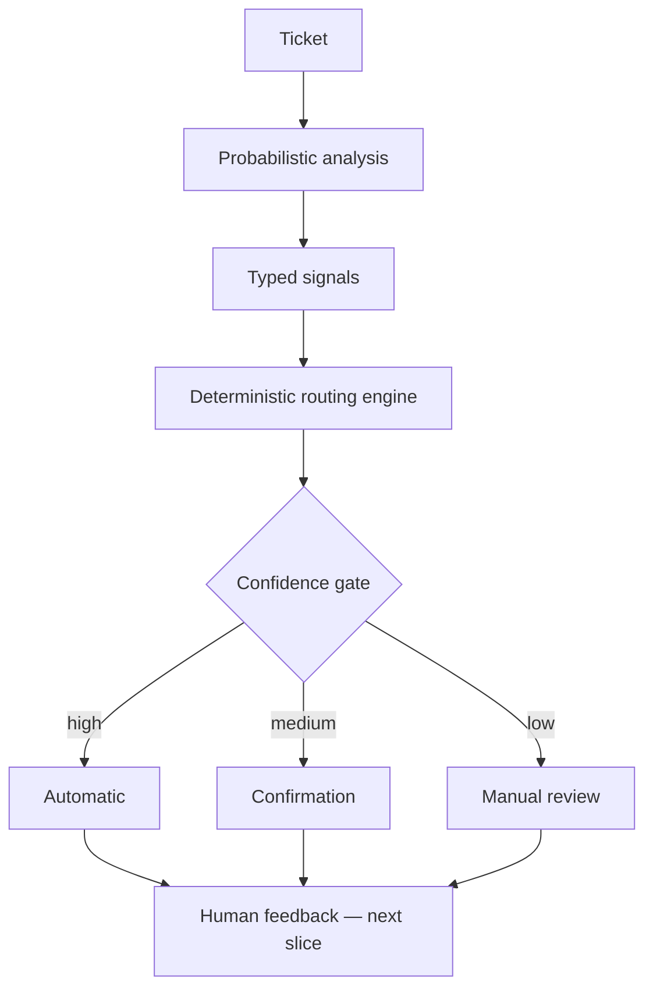

# Escalate

> Support tickets should not need to travel through three teams before reaching the person capable of solving them.

Escalate is an AI-assisted support ticket triage and escalation engine. A ticket enters the system; Escalate estimates what kind of issue it is, how serious and complex it appears, whether developer or security intervention is likely, and where it should go. A deterministic, configurable policy—not the model—makes the final routing decision.

This is not a chatbot or a generative-response product. Its core loop is **classification → triage → decision → escalation → human feedback**.

## Why this exists

Traditional queues often force tickets through L1, L2, and L3 even when the initial report clearly describes a production outage or security incident. That delays resolution and consumes support time. Blind AI automation is not a safe alternative: predictions are uncertain, thresholds are business policy, and operators need both explanations and override control.

Escalate puts a typed probabilistic model behind a deterministic decision boundary:

- Laya or a deterministic mock provider produces queryable signals and confidences.
- Explicit routing rules choose a support tier and technical team.
- A confidence gate decides whether routing is automatic, needs confirmation, or requires manual triage.
- The full evidence and reasons are returned to the operator and persisted independently.

## Working vertical slice

The repository currently implements one complete path rather than a collection of disconnected screens:

```text
Create ticket → persist ticket → analyze → persist signals
              → deterministic routing → persist decision
              → confidence gate → return and visualize result
```

Available endpoints:

| Method | Endpoint | Purpose |
|---|---|---|
| `POST` | `/api/v1/tickets` | Create, analyze, route, and return a ticket |
| `GET` | `/api/v1/tickets` | List persisted tickets |
| `GET` | `/api/v1/tickets/{id}` | Return a ticket with analysis and routing evidence |
| `GET` | `/health` | Verify API and database health |

The React dashboard creates tickets, shows the live triage queue, and renders the original report, normalized signals, recommendation, confidence mode, and deterministic reasons.

## Product screenshot



## Architecture





See the [architecture overview](docs/architecture/overview.md) and [ADRs](docs/adr/) for the design rationale.

## Probabilistic analysis vs. routing policy

`DecisionModel` is the dependency-inversion boundary. `MockDecisionModel` provides deterministic, realistic local scenarios. `LayaDecisionModel` initializes Laya's `Router(preload=True)` once at application startup and owns every detail of Laya's question and response formats.

The model returns category, sentiment, urgency, impact, complexity, developer probability, security probability, team suggestion, and individual confidences. `RoutingDecisionEngine` then evaluates centralized thresholds. Sentiment remains independent: an angry password-reset ticket stays L1, while a polite duplicated-transactions report can escalate immediately.

Default confidence policy:

| Routing confidence | Mode |
|---|---|
| `>= 0.90` | `AUTOMATIC` |
| `>= 0.70` and `< 0.90` | `REQUIRES_CONFIRMATION` |
| `< 0.70` | `MANUAL_TRIAGE` |

## Run locally

Docker Desktop is the only prerequisite for mock mode.

```bash
git clone https://github.com/LorenzoVicino/escalate.git
cd escalate
cp .env.example .env
docker compose up --build
```

Open:

- dashboard: `http://localhost:5173`
- API docs: `http://localhost:8000/docs`
- health: `http://localhost:8000/health`

Create a ticket directly:

```bash
curl -X POST http://localhost:8000/api/v1/tickets \
  -H "Content-Type: application/json" \
  -d '{
    "title": "All customer vehicles offline",
    "description": "Since 08:30 all 250 vehicles from our production fleet appear offline.",
    "customerName": "Acme Mobility",
    "source": "API"
  }'
```

The mock provider is the default and requires no model download. To develop against Laya locally, install the API's external extra and select the provider:

```bash
cd apps/api
python -m pip install -e ".[dev,laya]"
AI_PROVIDER=laya uvicorn escalate.main:app --reload
```

Laya is an external dependency (`laya==0.3.5`); its source is not copied into this repository. The first real-provider startup downloads and preloads model checkpoints. Docker builds intentionally omit that large dependency in mock mode; build the API with `INSTALL_LAYA=true` when real inference is required.

## Development checks

Backend (Python 3.11+):

```bash
cd apps/api
python -m pip install -e ".[dev]"
ruff check src tests
mypy src
pytest
```

Frontend (Node 22):

```bash
cd apps/web
npm ci
npm run lint
npm test
npm run build
```

CI runs both sets plus the PostgreSQL Alembic migration. Ordinary tests never load the real Laya model.

## Persistence and observability

Important fields are relational and queryable across separate `tickets`, `ticket_analyses`, and `routing_decisions` tables. Raw provider metadata has a constrained JSON escape hatch. Structured logs include request ID, ticket ID, provider, inference duration, routing result, confidence, and mode. The API echoes `x-request-id` for correlation.

## Benchmarks

No performance or accuracy result is claimed yet. The [benchmark methodology](benchmarks/README.md) defines the evidence required before results are committed. The included demo cases are behavioral fixtures, not a benchmark dataset.

## Roadmap

1. Add recommendation acceptance, override workflows, and a separate feedback relation.
2. Derive analytics and correction patterns only from persisted facts.
3. Add a versioned evaluation dataset and measured Laya calibration runs.
4. Add background analysis only when synchronous inference becomes an operational constraint.
5. Consider an LLM second opinion only for low-confidence cases, never as the default path.
6. Extract inference only if GPU isolation, independent scaling, or model release cadence demands it.

AWS evolution may use CloudFront/S3, ECS/Fargate, RDS, SQS, and optional Bedrock fallback, but local product quality and the safe decision workflow come first.

## License

MIT. See [LICENSE](LICENSE).
