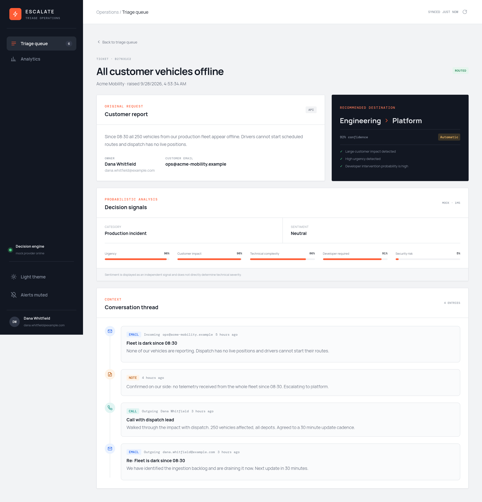
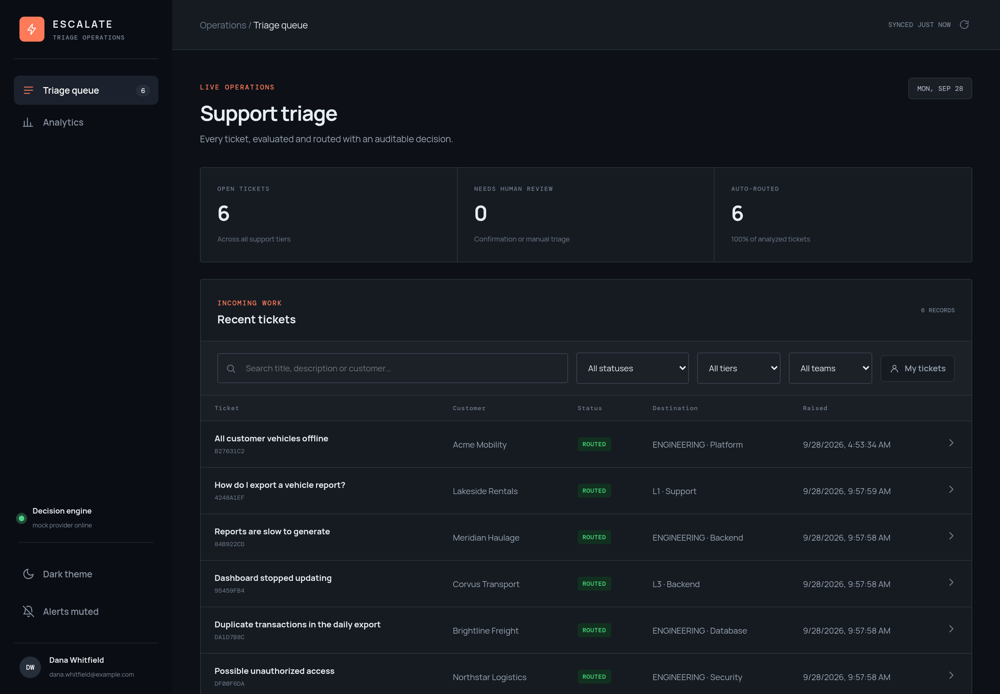
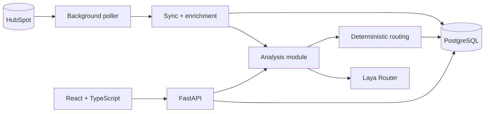
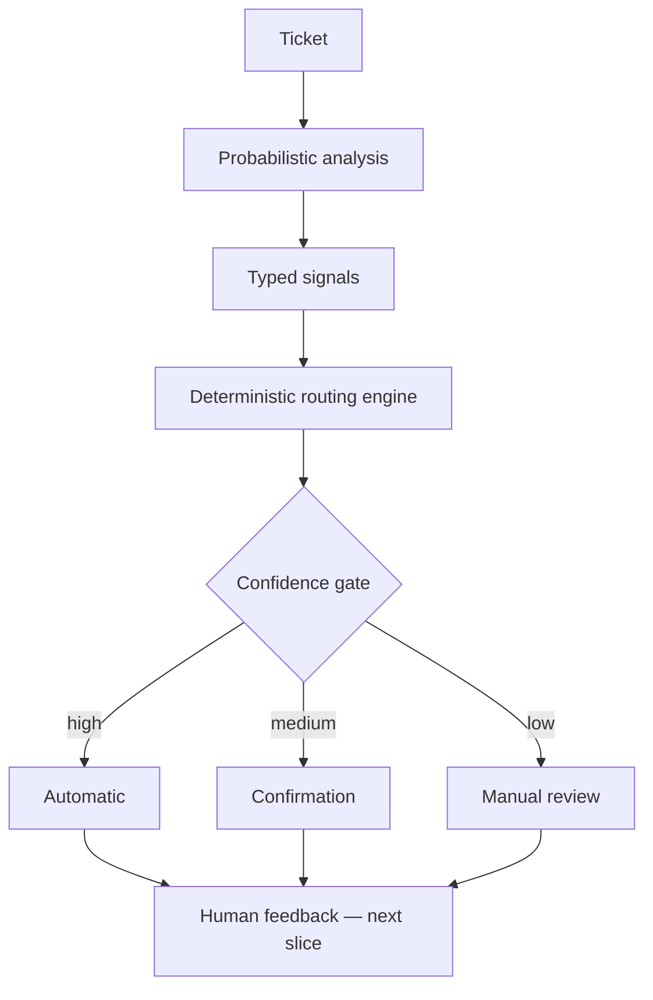

# Escalate

> Support tickets should not need to travel through three teams before reaching the person capable of solving them.

Escalate is an AI-assisted support ticket triage and escalation engine. A ticket enters the system; Escalate estimates what kind of issue it is, how serious and complex it appears, whether developer or security intervention is likely, and where it should go. A deterministic, configurable policy—not the model—makes the final routing decision.

This is not a chatbot or a generative-response product. Its core loop is **classification → triage → decision → escalation → human feedback**.

## Why this exists

Traditional queues often force tickets through L1, L2, and L3 even when the initial report clearly describes a production outage or security incident. That delays resolution and consumes support time. Blind AI automation is not a safe alternative: predictions are uncertain, thresholds are business policy, and operators need both explanations and override control.

Escalate puts a typed probabilistic model behind a deterministic decision boundary:

- Laya or a deterministic mock provider produces queryable signals and confidences.
- Explicit routing rules choose a support tier and technical team.
- A confidence gate decides whether routing is automatic, needs confirmation, or requires manual triage.
- The full evidence and reasons are returned to the operator and persisted independently.

## Working vertical slice

The repository currently implements one complete path rather than a collection of disconnected screens:

```text
Import from HubSpot → fetch conversation context → analyze (context included)
                    → persist signals → deterministic routing → persist decision
                    → confidence gate → return and visualize result
```

Context is fetched *before* analysis, so the notes, emails, calls and meetings attached
to a ticket in HubSpot inform the labels rather than arriving too late to matter.

Available endpoints:

| Method | Endpoint | Purpose |
|---|---|---|
| `GET` | `/api/v1/tickets` | List tickets, paginated and filterable (`ownerId`, `status`, `team`, `tier`, `q`) |
| `GET` | `/api/v1/tickets/stats` | Aggregate counts across all tickets matching the filters |
| `GET` | `/api/v1/tickets/{id}` | Return a ticket with analysis, routing evidence and conversation thread |
| `POST` | `/api/v1/tickets` | Create, analyze and route a ticket directly (used by tests; the UI is read-only) |
| `POST` | `/api/v1/integrations/hubspot/sync` | Import and route tickets from one HubSpot account |
| `GET` | `/api/v1/integrations/hubspot/owners` | List HubSpot users, for operator identification |
| `GET` | `/health` | Verify API and database health |

The React dashboard is a read-only triage queue: tickets arrive from HubSpot, never from an
intake form. It identifies the operator against the HubSpot user list, filters the queue
(including "my tickets"), polls in the background with an audible alert for new arrivals,
and renders the original report, conversation thread, normalized signals, recommendation,
confidence mode and deterministic reasons. Light and dark themes are both supported.

## Product screenshots

Ticket detail — the original request, the resolved owner and customer, the recommended
destination with its confidence mode and reasons, the decision signals, and the HubSpot
conversation thread that fed the analysis:



Triage queue in dark mode, with filters and aggregate stats:



Both screenshots use synthetic tickets, not real customer data.

## Architecture


```mermaid
flowchart LR
    HubSpot[(HubSpot)] --> Poller[Background poller]
    Poller --> Ingest[Sync + enrichment]
    Ingest --> Analysis[Analysis module]
    Web[React + TypeScript] --> API[FastAPI]
    API --> DB[(PostgreSQL)]
    API --> Analysis
    Analysis --> Laya[Laya Router]
    Analysis --> Routing[Deterministic routing]
    Routing --> DB
    Ingest --> DB
```


```mermaid
flowchart TD
    T[Ticket] --> A[Probabilistic analysis]
    A --> S[Typed signals]
    S --> R[Deterministic routing engine]
    R --> C{Confidence gate}
    C -->|high| Auto[Automatic]
    C -->|medium| Confirm[Confirmation]
    C -->|low| Manual[Manual review]
    Auto --> F[Human feedback — next slice]
    Confirm --> F
    Manual --> F
```

See the [architecture overview](docs/architecture/overview.md) and [ADRs](docs/adr/) for the design rationale.

## Probabilistic analysis vs. routing policy

`DecisionModel` is the dependency-inversion boundary. `MockDecisionModel` provides deterministic, realistic local scenarios. `LayaDecisionModel` initializes Laya's `Router(preload=True)` once at application startup and owns every detail of Laya's question and response formats.

The model returns category, sentiment, urgency, impact, complexity, developer probability, security probability, team suggestion, and individual confidences. `RoutingDecisionEngine` then evaluates centralized thresholds. Sentiment remains independent: an angry password-reset ticket stays L1, while a polite duplicated-transactions report can escalate immediately.

Default confidence policy:

| Routing confidence | Mode |
|---|---|
| `>= 0.90` | `AUTOMATIC` |
| `>= 0.70` and `< 0.90` | `REQUIRES_CONFIRMATION` |
| `< 0.70` | `MANUAL_TRIAGE` |

## Run locally

Docker Desktop is the only prerequisite for mock mode.

```bash
git clone https://github.com/LorenzoVicino/escalate.git
cd escalate
cp .env.example .env
docker compose up --build
```

Open:

- dashboard: `http://localhost:5173`
- API docs: `http://localhost:8000/docs`
- health: `http://localhost:8000/health`

Tickets come from HubSpot. Trigger an import:

```bash
curl -X POST "http://localhost:8000/api/v1/integrations/hubspot/sync?max_pages=1"
```

The mock provider is the default and requires no model download. To develop against Laya locally, install the API's external extra and select the provider:

```bash
cd apps/api
python -m pip install -e ".[dev,laya]"
AI_PROVIDER=laya uvicorn escalate.main:app --reload
```

Laya is an external dependency (`laya==0.3.5`); its source is not copied into this repository. Docker builds intentionally omit that large dependency in mock mode; build the API with `INSTALL_LAYA=true` when real inference is required.

Two operational costs are worth knowing before enabling it. The first startup downloads and
preloads three checkpoints from Hugging Face, which takes roughly five minutes — the compose
healthcheck allows for this with a `start_period`, and setting `HF_TOKEN` avoids anonymous
rate limits. On CPU, inference then costs roughly 20–80 seconds per ticket, so a first import
of a large pipeline is slow; already-imported tickets are skipped cheaply, and the poller
subtracts elapsed time from its interval so cycles never stack.

## HubSpot ticket ingestion

Escalate can import tickets from one HubSpot account using a Private App token. HubSpot remains the source system; imported records use `source=HUBSPOT` and the HubSpot record ID as `externalId`. A database constraint on `(source, external_id)` makes repeated syncs idempotent.

Create a HubSpot Private App, then set the token only in your local `.env`:

```text
HUBSPOT_ACCESS_TOKEN=pat-...
HUBSPOT_PIPELINE_ID=            # restrict the import to a single ticket pipeline
```

Scopes determine how much context Escalate can use. `crm.objects.tickets.read` is the
minimum; without the others the corresponding fields simply stay empty:

| Scope | Unlocks |
|---|---|
| `crm.objects.tickets.read` | The tickets themselves (required) |
| `crm.objects.owners.read` | Owner names and the operator dropdown |
| `crm.objects.contacts.read` | Customer email on the ticket |
| `crm.objects.notes.read` | Notes in the conversation thread |
| `sales-email-read` | Email bodies in the conversation thread |

After changing scopes, click **Commit changes** in the Private App editor — the token keeps
working but new scopes do not apply until committed.

The adapter requests only configured properties. Defaults map `subject` to title and `content` to description. Set `HUBSPOT_CUSTOMER_NAME_PROPERTY` when the account stores a customer label directly on tickets; otherwise Escalate uses a neutral fallback. The token is represented as a secret setting and is never included in logs or API errors.

Tickets are pulled newest-first. This is explicit rather than incidental: HubSpot's search API
returns oldest-first by default, which on a pipeline of any size fills the queue with years-old
tickets the poller can never advance past. Each ticket also stores the date it was raised in
HubSpot, so the queue sorts by ticket age rather than import order.

### Background polling

A poller imports on an interval so the queue stays current without manual syncs:

```text
HUBSPOT_POLL_INTERVAL_SECONDS=300   # seconds between cycles
HUBSPOT_POLL_MAX_PAGES=5            # pages per cycle, at HUBSPOT_SYNC_PAGE_SIZE each
```

It runs once at startup and then on the interval, measuring elapsed time so a slow cycle
delays rather than overlaps the next one. The dashboard refreshes independently and announces
new arrivals.

### Enrichment

For each newly imported ticket Escalate resolves the owner, the customer's email, and the
engagement timeline (notes, emails, calls, meetings, tasks). These are flattened into a
bounded plain-text digest — HTML stripped, oldest-first, capped by message count and
character budget via `ANALYSIS_CONTEXT_*` settings — and passed to the decision model with
the ticket, so the conversation informs the label.

Enrichment is best-effort by design: a missing scope or a failing call yields empty fields
rather than a failed sync. Owner names are resolved from a cached directory that includes
archived owners, because HubSpot's per-id owner endpoint returns 404 for deactivated users
who nonetheless own plenty of tickets.

This integration is read-only. A signed webhook receiver and optional write-back of routing
fields are separate changes because they require signature validation, operator
authorization, and retry policy.

## Development checks

Backend (Python 3.11+):

```bash
cd apps/api
python -m pip install -e ".[dev]"
ruff check src tests
mypy src
pytest
```

Frontend (Node 22):

```bash
cd apps/web
npm ci
npm run lint
npm test
npm run build
```

CI runs both sets plus the PostgreSQL Alembic migration on every push and pull request.
Ordinary tests never load the real Laya model.

## Releases

Tagging `v*` publishes container images to the GitHub Container Registry:

```bash
docker pull ghcr.io/lorenzovicino/escalate-api:latest
docker pull ghcr.io/lorenzovicino/escalate-web:latest
```

Published images default to the mock provider so they stay small; build with
`INSTALL_LAYA=true` for real inference.

## Persistence and observability

Important fields are relational and queryable across separate `tickets`, `ticket_analyses`, `routing_decisions`, and `ticket_messages` tables. Raw provider metadata has a constrained JSON escape hatch. Structured logs include request ID, ticket ID, provider, inference duration, routing result, confidence, and mode. The API echoes `x-request-id` for correlation.

## Benchmarks

No performance or accuracy result is claimed yet. The [benchmark methodology](benchmarks/README.md) defines the evidence required before results are committed. The included demo cases are behavioral fixtures, not a benchmark dataset.

## Roadmap

1. Replace interval polling with a signed HubSpot webhook receiver and a durable ingestion inbox.
2. Add recommendation acceptance, override workflows, and a separate feedback relation.
3. Derive analytics and correction patterns only from persisted facts.
4. Add a versioned evaluation dataset and measured Laya calibration runs.
5. Add background analysis when webhook volume makes synchronous inference an operational constraint.
6. Consider an LLM second opinion only for low-confidence cases, never as the default path.
7. Extract inference only if GPU isolation, independent scaling, or model release cadence demands it.

AWS evolution may use CloudFront/S3, ECS/Fargate, RDS, SQS, and optional Bedrock fallback, but local product quality and the safe decision workflow come first.

## License

MIT. See [LICENSE](LICENSE).
