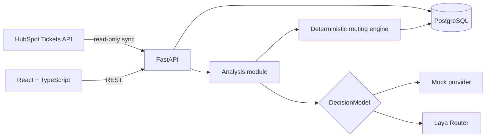
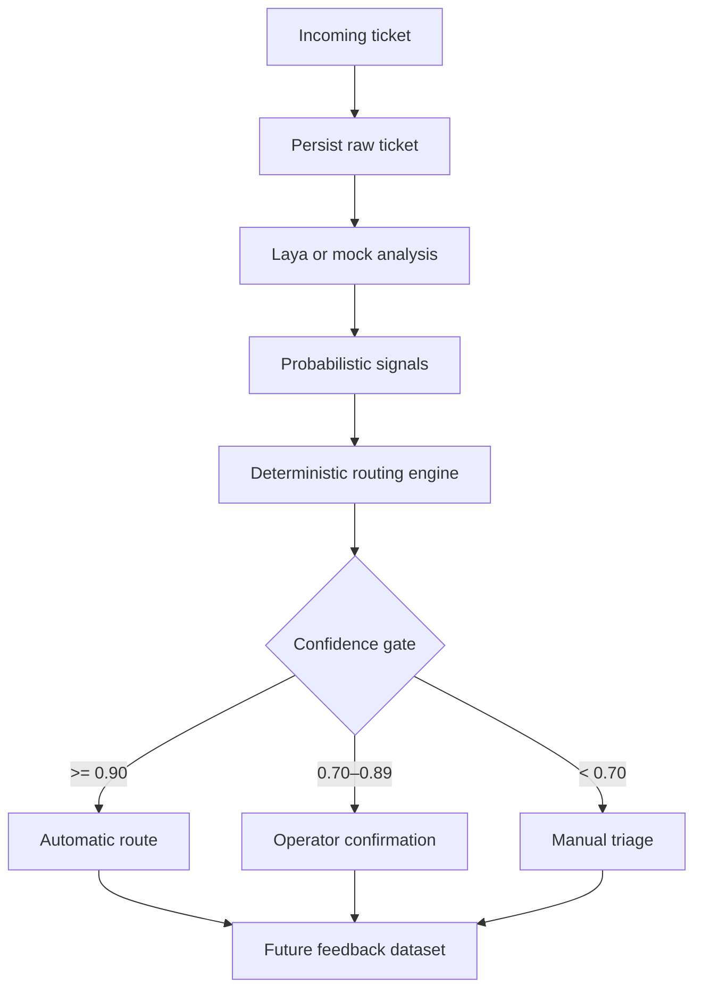
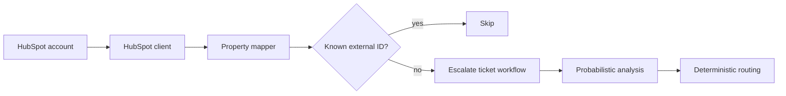

# Architecture

Escalate starts as a modular monolith. HTTP orchestration, ticket lifecycle, probabilistic analysis, deterministic routing, and persistence have explicit boundaries inside one deployable API. The `DecisionModel` protocol is the seam for a future inference-service extraction if independent GPU scaling or model releases justify it.

## Decision lifecycle

## Implemented vertical slice

`POST /api/v1/tickets` owns a single transaction: it persists the ticket, invokes the configured provider, persists queryable analysis fields, evaluates routing rules, persists the decision, applies the confidence gate, and returns the complete result. If any stage fails, the transaction is rolled back.

The mock provider uses deterministic keyword scenarios only inside its adapter. No mock behavior leaks into the routing engine. The Laya adapter owns model initialization, question definitions, response parsing, normalization, and provider metadata.

## HubSpot boundary

The HubSpot adapter is an inbound anti-corruption layer. It owns authentication headers, pagination, remote response models, and configurable property mapping. The rest of Escalate receives a normal `TicketCreate` with `source=HUBSPOT`; no analysis or routing module imports HubSpot concepts.

Repeated imports are safe because `(source, external_id)` is unique and the sync service skips records already processed. The initial endpoint is bounded by `max_pages`, returns the next cursor when work remains, and never exposes the Private App token. Webhook ingestion is deferred until a durable inbox and signature verification are implemented together.

